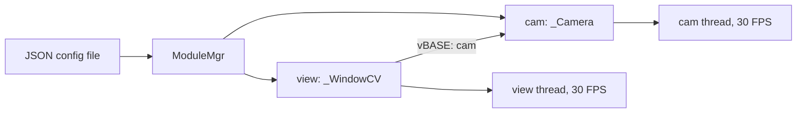
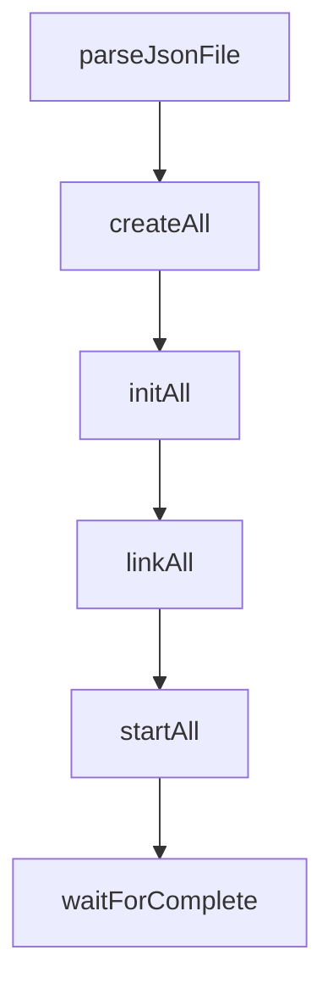

# Architecture Overview

This page gives you the first mental model for OpenKAI: one executable reads a JSON file, creates named module instances, connects those modules by name, and starts their worker threads. A **module graph** is the set of configured module instances and the named relationships between them.

## Start With A Tiny App

`jsonCfg/helloOK.json` defines a camera module named `cam` and a display module named `view`. The display refers to the camera by name:

```json
"view": {
  "class": "_WindowCV",
  "bON": true,
  "thread": { "name": "thread", "class": "_Thread", "FPS": 30 },
  "vBASE": ["cam"]
},
"cam": {
  "class": "_Camera",
  "bON": true,
  "thread": { "name": "thread", "class": "_Thread", "FPS": 30 }
}
```

Source: `jsonCfg/helloOK.json:20` and `jsonCfg/helloOK.json:33`.

The important idea is that `view` and `cam` are not hardcoded in `main()`. The JSON file names them, chooses their C++ classes, enables them with `bON`, and gives each one a `thread` configuration.

## The Runtime Shape

OpenKAI is launched as a single program:

```text
./OpenKAI jsonCfg/helloOK.json
```

Inside that process, OpenKAI builds the app described by JSON:



A **module** is a C++ object managed by OpenKAI and usually responsible for one device, transformation, protocol, or UI surface. See [Modules](modules.md) for the fuller definition.

A **thread** is the worker owned by many modules. OpenKAI uses a `_Thread` object to store target FPS and run state, then starts a pthread-backed update loop for the module.

## The Lifecycle

The application lifecycle is the fixed startup sequence OpenKAI follows for every config:



This exact order is visible in `src/main.cpp:52`, where `main()` calls `parseJsonFile`, then `createAll`, `initAll`, `linkAll`, and `startAll`.

Each stage has a different job:

- `parseJsonFile` loads the JSON input.
- `createAll` reads top-level JSON objects, checks `class` and `bON`, and creates C++ module instances. See `src/Module/ModuleMgr.cpp:54`.
- `initAll` gives each module its own JSON object so it can read settings.
- `linkAll` lets modules resolve references to other modules after every instance exists. See `src/Module/ModuleMgr.cpp:138`.
- `startAll` starts each module. See `src/Module/ModuleMgr.cpp:163`.

This order prevents a common startup problem: a module cannot safely point to another module until that other module has already been created.

## How JSON Becomes Objects

During `createAll`, OpenKAI treats each top-level JSON object as a possible module instance. It reads the top-level key as the module name, reads the nested `class`, skips disabled modules where `bON` is `0`, and calls the module factory. The factory is the part of the SDK that turns a class name string such as `_Camera` into a C++ object. See [The Factory](the-factory.md).

The implementation reads `class` at `src/Module/ModuleMgr.cpp:80`, checks `bON` at `src/Module/ModuleMgr.cpp:89`, calls `createInstance()` at `src/Module/ModuleMgr.cpp:97`, and stores the created module under its JSON name at `src/Module/ModuleMgr.cpp:104`.

If the `class` field is missing or names a class that was not compiled into the binary, the instance is not created. The rest of the config may still be read, but any module that expected to link to that missing instance will not have the pointer it needs.

## How Modules Connect

OpenKAI links modules by name. **Linking by name** means a JSON field stores another module's configured name, and the C++ module asks `ModuleMgr` to turn that name into a pointer.

For UI modules, the common field is `vBASE`, an array of module names. `_UIbase` reads `vBASE`, calls `findModule()` for each name, and stores the resolved pointers. See `src/UI/_UIbase.cpp:32` and `src/UI/_UIbase.cpp:37`.

The name lookup itself is implemented by `ModuleMgr::findModule()`, which scans the created modules for a matching name at `src/Module/ModuleMgr.cpp:229`.

If a name is misspelled, the module may start without the dependency it expected. In the `helloOK` example, if `view` points at `"camera"` instead of `"cam"`, `_WindowCV` will not receive the camera module through `vBASE`, so there is nothing useful for it to draw.

## How Work Runs

Many OpenKAI modules inherit from `_ModuleBase`. During initialization, `_ModuleBase` creates a `_Thread` from the module's nested `thread` JSON object. See `src/Base/_ModuleBase.cpp:25`.

The thread reads `FPS` at `src/Base/_Thread.cpp:48`, starts a pthread at `src/Base/_Thread.cpp:77`, and uses `autoFPS()` to sleep long enough to approach the configured rate. See `src/Base/_Thread.cpp:181`.

An **FPS-regulated update loop** is a repeating module loop that tries to run at a configured frames-per-second rate. In practice, this is how a camera module, filter module, or UI module performs work continuously without needing a separate scheduler.

If the `thread` object is missing for a threaded module, `_ModuleBase` cannot create its `_Thread`. If `FPS` is too high for the actual work being done, the module can fall behind even though the config says it should run faster.

## The Shape To Remember

The core architecture is compact:

```text
JSON config
  -> named module instances
  -> factory-created C++ objects
  -> name-based links between modules
  -> FPS-regulated worker threads
```

Most of the SDK becomes easier to read once you can identify those five pieces in any config file or module implementation.

Next: [Modules](modules.md)
