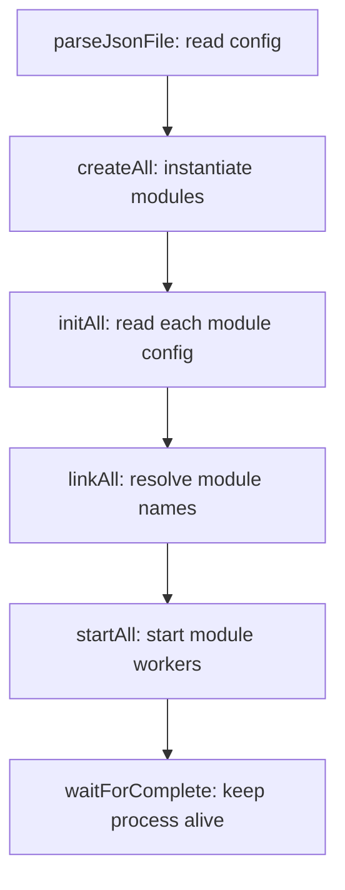

# Lifecycle

This page explains OpenKAI's startup lifecycle: `parseJsonFile -> createAll -> initAll -> linkAll -> startAll`. The order is the backbone of the framework because each stage prepares something the next stage needs.

## Start With A Config Entry

The lifecycle starts with a JSON file. In `helloOK.json`, the `cam` object is not a C++ object yet; it is only configuration:

```json
"cam": {
  "class": "_Camera",
  "bON": true,
  "thread": { "name": "thread", "class": "_Thread", "FPS": 30 }
}
```

Source: `jsonCfg/helloOK.json:33`.

The lifecycle is the sequence that turns that config entry into a live `_Camera` object with an initialized thread and a running update loop.

## Then Follow `main()`

OpenKAI starts from `src/main.cpp`. After checking the command-line argument, `main()` runs the lifecycle in a fixed order:

```text
parseJsonFile
createAll
initAll
linkAll
startAll
waitForComplete
```

The call sequence is visible at `src/main.cpp:52`.

## Lifecycle Diagram



A **lifecycle stage** is one pass over the app where OpenKAI performs a specific kind of setup for every configured module.

## `parseJsonFile`

`parseJsonFile` reads the main JSON file into a `JsonCfg` object. See `src/Module/ModuleMgr.cpp:25`.

It also reads `APP.vInclude` and parses any included config files. See `src/Module/ModuleMgr.cpp:36`.

If the main JSON file cannot be read or parsed, `main()` exits before module creation. The parse failure check is at `src/main.cpp:52`.

## `createAll`

`createAll` turns enabled JSON entries into C++ objects.

It reads each top-level JSON key as a module name, reads `class`, checks `bON`, calls the factory, and stores the created object. See `src/Module/ModuleMgr.cpp:54`.

For `helloOK.json`, `view` and `cam` are created, while `console` is skipped because `bON` is false.

If `createAll` did not happen before `linkAll`, there would be no module objects for name lookups to return.

## `initAll`

`initAll` calls `init()` on every created module and passes that module's JSON object.

The module manager finds the matching JSON by module name at `src/Module/ModuleMgr.cpp:119`, then calls `pB->init(j)` at `src/Module/ModuleMgr.cpp:126`.

This is where modules read configuration values. For threaded modules, `_ModuleBase::init()` creates the `_Thread` from the nested `thread` object at `src/Base/_ModuleBase.cpp:25`.

If initialization fails, startup stops before links or threads are created.

## `linkAll`

`linkAll` calls `link()` on every created module after initialization.

This stage exists so modules can safely resolve references to other modules. The manager calls each module's `link()` method at `src/Module/ModuleMgr.cpp:151`.

For example, `_UIbase::link()` reads `vBASE` and resolves names through `findModule()` at `src/UI/_UIbase.cpp:32`.

If `linkAll` ran before `createAll`, links would fail because target modules might not exist yet. If it ran before `initAll`, modules might not have initialized the fields they need to store those links.

## `startAll`

`startAll` calls `start()` on every created module. See `src/Module/ModuleMgr.cpp:163`.

For `_ModuleBase`-derived modules, `start()` starts the worker thread at `src/Base/_ModuleBase.cpp:71`.

After this stage, modules begin doing runtime work: reading sensors, processing data, refreshing UI, or talking to protocols.

If a module starts before its links are resolved, it may enter its update loop without required dependencies.

## `waitForComplete`

After modules start, `main()` calls `waitForComplete()` at `src/main.cpp:75`.

The current implementation loops while `bComplete()` is false. `bComplete()` currently returns false, so OpenKAI stays alive until it is interrupted. See `src/Module/ModuleMgr.cpp:206`.

That means the normal app shape is long-running: start modules, keep their loops alive, and stop through external interruption such as SIGINT.

## What Goes Wrong

If JSON parsing fails, none of the later stages run.

If creation fails for a module, that module is absent from all later stages.

If initialization fails, startup stops before linking and starting.

If linking fails, startup stops before worker threads begin.

If starting fails, the app exits before reaching the long-running wait state.

Next: [Trace A Config End To End](../how-to/trace-a-config-end-to-end.md)
