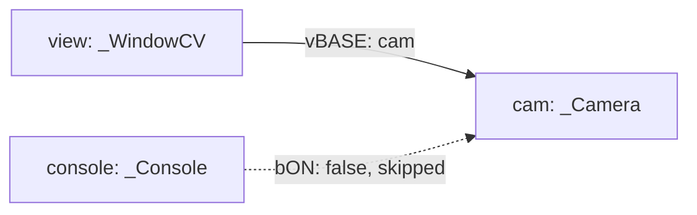

# Anatomy Of `helloOK.json`

This page walks through `jsonCfg/helloOK.json` as a concrete OpenKAI app definition. The goal is to connect each JSON field to the runtime behavior described in [Your First Run](your-first-run.md).

## The Whole Shape

`helloOK.json` has one app metadata object and three module objects:

```text
APP
console
view
cam
```

Source: `jsonCfg/helloOK.json:2`, `jsonCfg/helloOK.json:8`, `jsonCfg/helloOK.json:20`, and `jsonCfg/helloOK.json:33`.

A **module instance** is one configured object in the running OpenKAI process. In this file, `view` is a module instance whose C++ class is `_WindowCV`, and `cam` is a module instance whose C++ class is `_Camera`.

## `APP`: App-Level Settings

```json
"APP": {
  "class": "ModuleMgr",
  "appName": "helloOK",
  "bLog": true,
  "bStdErr": true
}
```

Source: `jsonCfg/helloOK.json:2`.

`APP` is not a normal device or UI module. It describes app-level behavior for the manager.

`class` is present here as `ModuleMgr`, but `createAll()` explicitly skips entries whose class is `ModuleMgr`. That skip is implemented at `src/Module/ModuleMgr.cpp:82`.

`appName` gives the app a human-readable name. `bLog` controls logging intent in the config. `bStdErr` controls whether standard error stays visible; `main()` checks `bStdErr()` after parsing and can redirect stderr to `/dev/null` at `src/main.cpp:58`. The lookup for `APP.bStdErr` is implemented at `src/Module/ModuleMgr.cpp:271`.

## `console`: A Disabled Module

```json
"console": {
  "class": "_Console",
  "bON": false,
  "thread": {
    "name": "thread",
    "class": "_Thread",
    "FPS": 10
  },
  "vBASE": ["cam"]
}
```

Source: `jsonCfg/helloOK.json:8`.

`console` shows an important config feature: a module can stay in the file while being disabled.

`bON` controls whether `createAll()` instantiates the module. `createAll()` reads `bON` at `src/Module/ModuleMgr.cpp:89` and skips the module if it is `0`.

Because `console` is disabled, its `thread` and `vBASE` fields are not used in this run. They would matter if `bON` were changed to `true`.

## `view`: The Window Module

```json
"view": {
  "class": "_WindowCV",
  "bON": true,
  "thread": {
    "name": "thread",
    "class": "_Thread",
    "FPS": 30
  },
  "bFullScreen": false,
  "vBASE": ["cam"]
}
```

Source: `jsonCfg/helloOK.json:20`.

`view` is the configured name of this module instance. During creation, `ModuleMgr` stores the object under that name with `setName()` at `src/Module/ModuleMgr.cpp:104`.

`class` selects the C++ class. Here, `_WindowCV` is the OpenCV-backed window module.

`bON: true` means this module should be created.

`thread` describes the worker thread used by this module. `_ModuleBase` reads the nested `thread` object and creates a `_Thread` at `src/Base/_ModuleBase.cpp:25`.

`FPS: 30` gives the thread its target update rate. `_Thread::init()` reads `FPS` at `src/Base/_Thread.cpp:48`.

`bFullScreen` is specific to `_WindowCV`. `_WindowCV::init()` reads it at `src/UI/_WindowCV.cpp:28`.

`vBASE` links `view` to one or more other modules by name. `_UIbase` reads `vBASE` and resolves each name through the module manager at `src/UI/_UIbase.cpp:32`.

If `vBASE` does not include `cam`, the window still exists, but it does not receive the camera module as a drawing source.

## `cam`: The Camera Module

```json
"cam": {
  "class": "_Camera",
  "bON": true,
  "thread": {
    "name": "thread",
    "class": "_Thread",
    "FPS": 30
  },
  "deviceID": 0,
  "vSizeRGB": [640, 480]
}
```

Source: `jsonCfg/helloOK.json:33`.

`cam` is the configured name that other modules use when they want this camera.

`class: "_Camera"` selects the C++ camera module. The class must be compiled into the binary, or the factory cannot create the instance.

`thread` gives the camera its own worker loop. `_Camera::start()` starts that loop at `src/Vision/_Camera.cpp:74`.

`deviceID` is camera-specific configuration. `_Camera::init()` reads it at `src/Vision/_Camera.cpp:30`, and `_Camera::open()` passes it to OpenCV camera opening at `src/Vision/_Camera.cpp:42`.

`vSizeRGB` asks the camera module for an RGB frame size. `_Camera::open()` applies width and height to the capture device at `src/Vision/_Camera.cpp:49`.

If the machine has no camera at `deviceID: 0`, `_Camera::open()` logs a failure and the update loop sleeps before trying again. See `src/Vision/_Camera.cpp:42` and `src/Vision/_Camera.cpp:86`.

## The Resulting Module Graph



The running app contains `view` and `cam`. `console` is present in the file but not created.

The most important relationship is `view -> cam`: the window asks the camera module to draw its current frame. `_WindowCV::updateWindow()` loops over linked modules and calls `draw()` on each one at `src/UI/_WindowCV.cpp:65`.

## What To Change First

For a first controlled edit, change only values that do not alter the module graph:

```json
"FPS": 15,
"bFullScreen": true,
"vSizeRGB": [1280, 720]
```

Changing `class`, `bON`, or `vBASE` changes which modules exist or how they connect. Those are more structural edits, and they are easier to understand after reading [Configuration](../concepts/configuration.md) and [Linking](../concepts/linking.md).

Next: [Architecture Overview](../concepts/architecture-overview.md)
