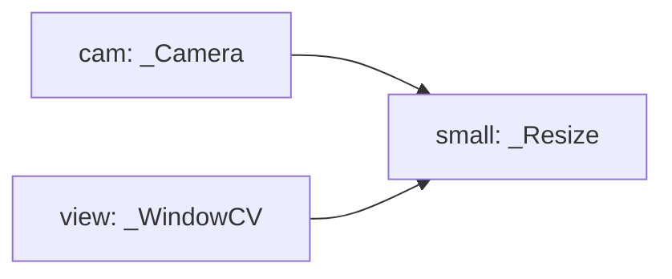

# Add A Module To A Config

This guide shows how to add a new module instance to a JSON config when the C++ module already exists in the binary. No new C++ code is needed for this path; you are only adding another configured instance to the module graph.

## Example: Add A Resize Module

Start from the `helloOK.json` shape:

```json
"cam": {
  "class": "_Camera",
  "bON": true,
  "thread": { "name": "thread", "class": "_Thread", "FPS": 30 }
},
"view": {
  "class": "_WindowCV",
  "bON": true,
  "thread": { "name": "thread", "class": "_Thread", "FPS": 30 },
  "vBASE": ["cam"]
}
```

Source: `jsonCfg/helloOK.json:20` and `jsonCfg/helloOK.json:33`.

Now add a new module instance named `small`:

```json
"small": {
  "class": "_Resize",
  "bON": true,
  "thread": { "name": "thread", "class": "_Thread", "FPS": 30 },
  "_VisionBase": "cam",
  "vSizeRGB": [320, 240]
}
```

`small` is the configured module name. `_Resize` is the compiled C++ class. `_VisionBase` tells `_Resize` which existing vision module to read from.

## Point The Window At The New Module

To display the resized output, change the window's `vBASE` from `cam` to `small` in your working config:

```json
"vBASE": ["small"]
```

`_UIbase::link()` reads `vBASE` and resolves each name through the module manager at `src/UI/_UIbase.cpp:32`.

The resulting graph is:



## Check The Class Is Compiled In

Adding a config entry only works if the class exists in the current binary.

`_Resize` is registered in the factory at `src/Module/Module.cpp:289`, under the vision and OpenCV build gates. If the factory registration is not compiled in, `createInstance("_Resize")` returns no object.

The factory call happens during `createAll()` at `src/Module/ModuleMgr.cpp:97`.

## Check The Link Field

`_Resize` does not use `vBASE` for its input. It uses `_VisionBase`.

The implementation reads `_VisionBase` at `src/Vision/ImgFilter/_Resize.cpp:34`, resolves it with `findModule()`, and fails if the pointer is missing.

This means `"cam"` must name an enabled module instance that exists by the time `linkAll()` runs.

## Check The Size Field

`_Resize` inherits `_VisionBase`, and `_VisionBase::init()` reads `vSizeRGB` at `src/Vision/_VisionBase.cpp:36`.

Use `vSizeRGB` when documenting or creating a new resize config unless the source is changed to support another field. See [`_questions.md`](../_questions.md) for a note about an existing sample that appears to use a different size key.

## What Goes Wrong

If `small` uses a duplicate top-level name, `createAll()` skips it because duplicate names are checked at `src/Module/ModuleMgr.cpp:74`.

If `_VisionBase` points to a disabled or misspelled module name, `_Resize::link()` fails because the required input pointer is null.

If `view` still points at `cam`, the resize module may run, but the window will continue drawing the original camera frame.

Next: [Write A New Module](write-a-new-module.md)
