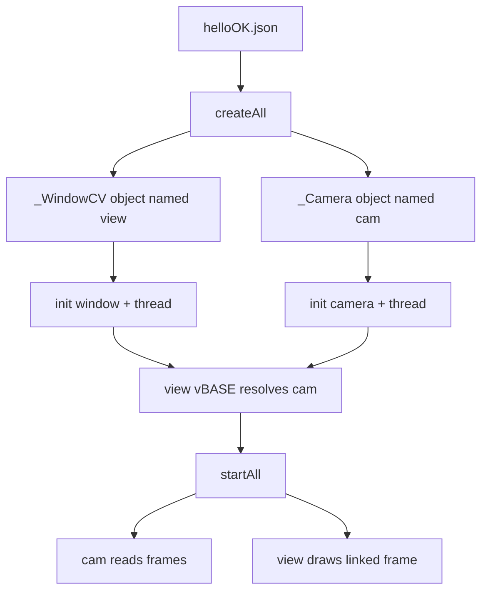

# Trace A Config End To End

This guide traces one small OpenKAI app from JSON to running modules: `helloOK.json` creates a camera, creates a window, links the window to the camera, then starts both update loops.

## The Config Slice

Start with the two enabled modules in `jsonCfg/helloOK.json`:

```json
"view": {
  "class": "_WindowCV",
  "bON": true,
  "thread": { "name": "thread", "class": "_Thread", "FPS": 30 },
  "vBASE": ["cam"]
},
"cam": {
  "class": "_Camera",
  "bON": true,
  "thread": { "name": "thread", "class": "_Thread", "FPS": 30 },
  "deviceID": 0
}
```

Source: `jsonCfg/helloOK.json:20` and `jsonCfg/helloOK.json:33`.

The goal is to answer: how do these JSON objects become a camera frame shown in a window?

## Step 1: The Manager Reads Top-Level Entries

`ModuleMgr::createAll()` walks every top-level JSON object. It reads the object key as the module name, then reads the nested `class` and `bON` fields.

The loop starts at `src/Module/ModuleMgr.cpp:54`. It reads the module name at `src/Module/ModuleMgr.cpp:67`, reads `class` at `src/Module/ModuleMgr.cpp:80`, and checks `bON` at `src/Module/ModuleMgr.cpp:89`.

For this config:

- `view` is enabled and asks for `_WindowCV`.
- `cam` is enabled and asks for `_Camera`.
- `console` is disabled, so it is skipped.

If either enabled class is not compiled into the binary, creation for that module fails before initialization.

## Step 2: The Factory Creates Objects

After reading `class`, the manager calls `Module::createInstance()` at `src/Module/ModuleMgr.cpp:97`.

The factory is the list of `ADD_MODULE(...)` registrations in `src/Module/Module.cpp`. `_WindowCV` is registered at `src/Module/Module.cpp:245`, and `_Camera` is registered at `src/Module/Module.cpp:272`.

At the end of creation, `ModuleMgr` stores the created object under its configured name with `setName()` at `src/Module/ModuleMgr.cpp:104`.

After this step, OpenKAI has objects named `view` and `cam`.

## Step 3: Each Module Initializes

`initAll()` finds the JSON object for each created module and calls its `init()` method. The manager does this at `src/Module/ModuleMgr.cpp:113`.

`_Camera::init()` reads camera-specific configuration such as `deviceID` at `src/Vision/_Camera.cpp:28`.

`_WindowCV::init()` reads window-specific configuration such as `bFullScreen` at `src/UI/_WindowCV.cpp:24`.

Both modules inherit threaded behavior. `_ModuleBase::init()` creates the nested `_Thread` object from the `thread` JSON at `src/Base/_ModuleBase.cpp:25`.

If the `thread` object is malformed, initialization fails before the modules are linked or started.

## Step 4: The Window Links To The Camera

`linkAll()` calls each module's `link()` method after every enabled module has been created and initialized. The manager calls `link()` at `src/Module/ModuleMgr.cpp:151`.

For `view`, `_UIbase::link()` reads:

```json
"vBASE": ["cam"]
```

Source: `jsonCfg/helloOK.json:29`.

It calls `findModule("cam")` and stores the returned pointer. The `vBASE` read is at `src/UI/_UIbase.cpp:32`, and the lookup call is at `src/UI/_UIbase.cpp:37`.

If `"cam"` is misspelled, `view` still exists, but it has no camera module to draw from.

## Step 5: The Camera Starts Reading Frames

`startAll()` calls `start()` on every created module at `src/Module/ModuleMgr.cpp:163`.

`_Camera::start()` starts the camera update thread at `src/Vision/_Camera.cpp:74`.

Inside the camera loop, `_Camera` opens the configured device, calls `autoFPS()`, reads a frame, and copies it into its internal frame object. The loop starts at `src/Vision/_Camera.cpp:80`, and frame copy happens at `src/Vision/_Camera.cpp:98`.

If the device cannot be opened, `_Camera::open()` returns false after logging the failure; that path starts at `src/Vision/_Camera.cpp:42`.

## Step 6: The Window Draws The Linked Frame

`_WindowCV::start()` starts the window update thread at `src/UI/_WindowCV.cpp:49`.

The window loop calls `autoFPS()` and then `updateWindow()`. See `src/UI/_WindowCV.cpp:55`.

`updateWindow()` loops over the modules resolved from `vBASE`, calls `draw()` on each one, and displays the frame with OpenCV. The draw loop starts at `src/UI/_WindowCV.cpp:65`.

In this app, the linked module is `cam`, so `view` asks `cam` to draw its latest frame.

## The Full Trace



This trace is the basic OpenKAI reading skill: find the JSON entry, identify the class, find the factory registration, read `init()`, read `link()`, then read `start()` and `update()`.

Next: [Add A Module To A Config](add-a-module-to-a-config.md)
